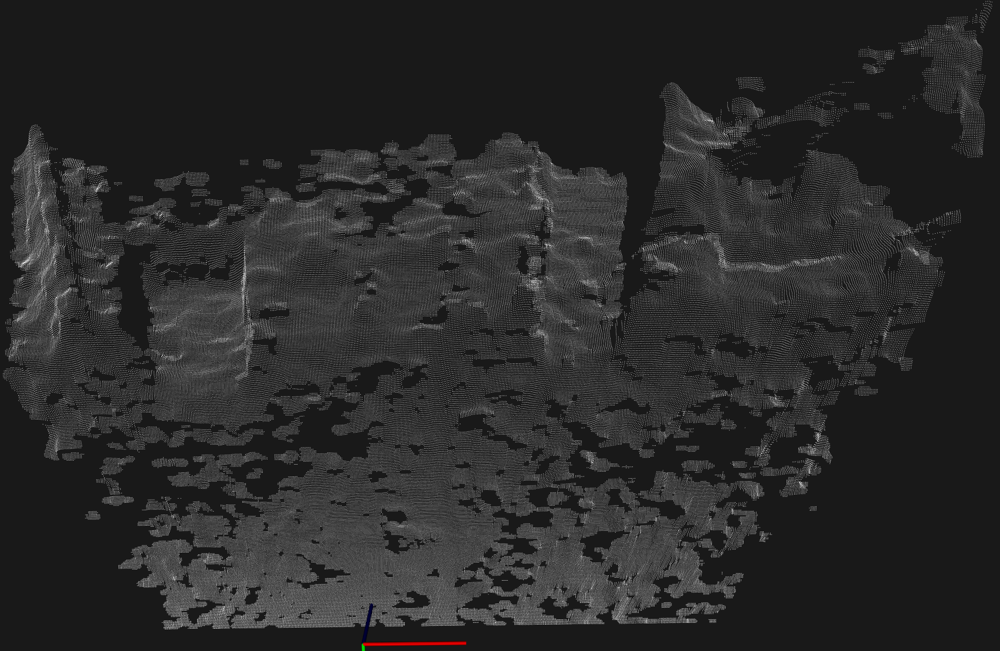
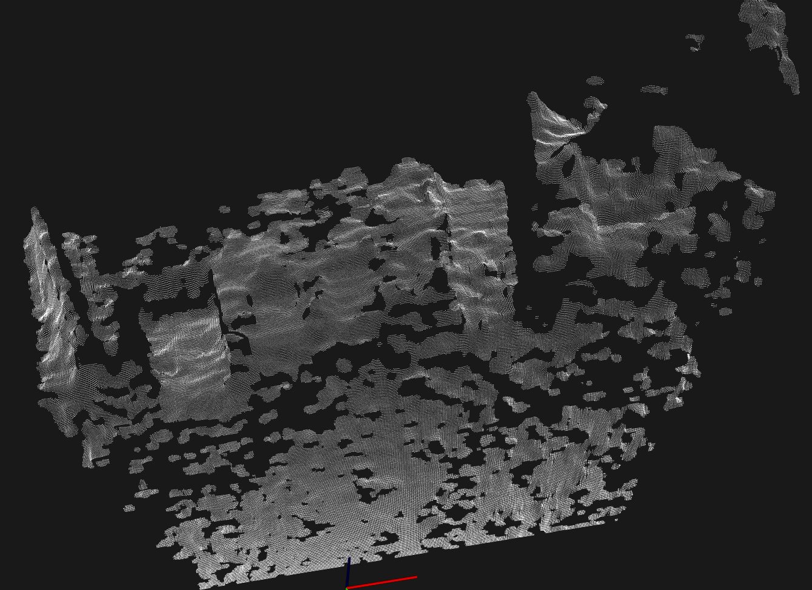
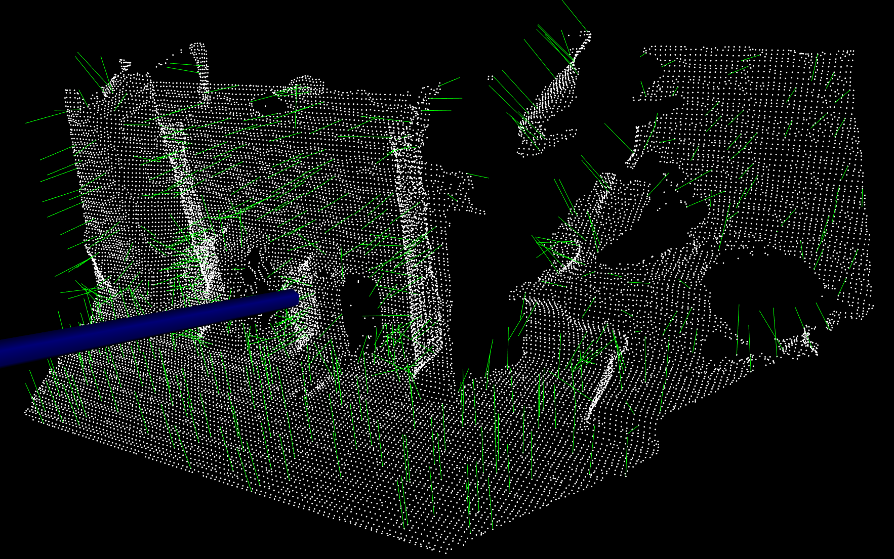
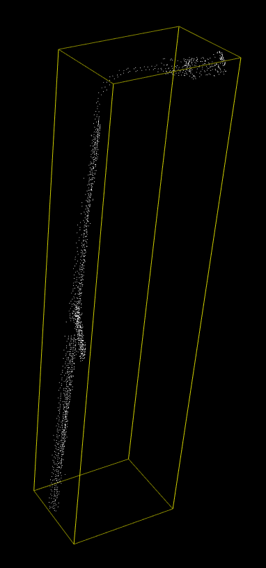
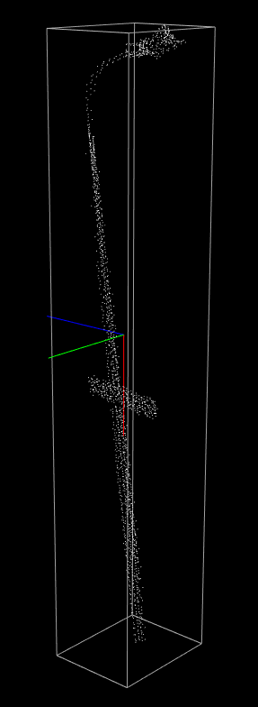

# Filter outliers

use `statistical outlier removal` to filter those outliers

| Before                                                       | After                                                        |
| ------------------------------------------------------------ | ------------------------------------------------------------ |
|  |  |

能够从两图中对比看出，主要是边缘圆滑了一些，这里应该就是应用了Radu论文的4.2 Filtering outliers当中的原理，如果有的点周围一个标准差正态分布范围没有其他点，那么认为这个点是孤立的outliers。

【2020年12月10日】
可以看到上面两幅点云的质量很差，realsense的点云成像效果与光照和物体表面材质都有关系，（也有可能是后处理参数不合适），后面重新生成了几幅，条件合适的话点云质量经过后处理后也挺不错的。后处理参数可以在realsense-viewer里面尝试。

# Normal

[show pointcloud normals](./normal.cpp) shows normals of a pointcloud.

This program demonstrates the usage of normal estimator and pcl visualizer that enables the display of normals.

This is done by PCA (Principal Components Analysis). A simple 2D data points PCA is implemented in [PCA](./pca.ipynb).

# Point Feature Histogram

[Point Feature Histogram](./pfh.cpp) obtains the PFH descriptors of a pointcloud. PFH is a local feature representation. So if you want to visualize the histogram, you have to specify a point. 【目前没有做可视化】

# Moment of Inertia and Eccentricity based descriptor

[Moment of Inertia  and Eccentricity based descriptor](./MoI.cpp) allows extract axis aligned and oriented bounding boxes of the cloud.

|  |  |
| ------------------------------------------------------------ | ------------------------------------------------------------ |
| Axis aligned bounding box                                    | oriented bounding box                                        |

