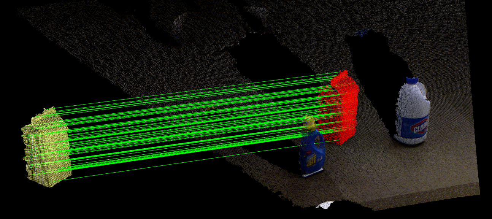
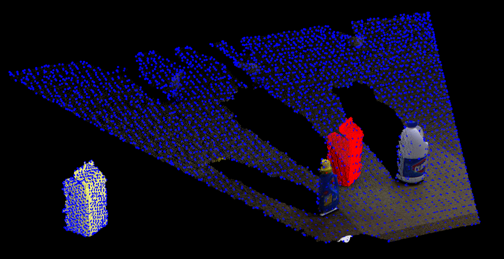
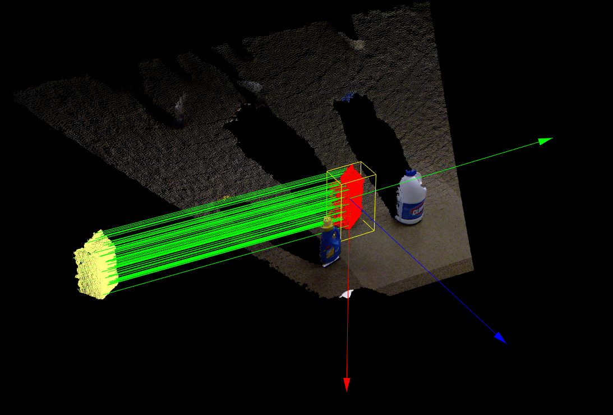

# [Recognition](https://pcl.readthedocs.io/projects/tutorials/en/latest/correspondence_grouping.html#correspondence-grouping)

## [correspondence group](./correspondenceGroup.cpp)




[如何提取model在scene中的点云 ?] 
[怎么获得模型点云 ?]

图中的红色匹配是由model点云经变换移过去的.

Keypoints



根据model的descriptor在scene中找对应的descriptor, 计算descriptor的距离. 使用FLANN加速了计算.

```cpp
pcl::CorrespondencesPtr model_scene_correspondence (new pcl::Correspondences);
pcl::KdTreeFLANN<pcl::SHOT352> match_search;
// 使用 model descriptor 作为模板
match_search.setInputCloud(model_decriptor);

for (std::size_t i = 0; i < scene_descriptor->size(); ++i)
{
    std::vector<int> neighbor_indices (1);
    std::vector<float> neighbor_distance_indices (1);
    int found_neighbor = match_search.nearestKSearch(scene_descriptor->at(i), 1, neighbor_indices, neighbor_distance_indices);
    //  add match only if the squared descriptor distance is less than 0.25 (SHOT descriptor distances are between 0 and 1 by design)
        if (found_neighbor == 1 && neighbor_distance_indices[0] <0.25f)
        {
            pcl::Correspondence correspondence(neighbor_indices[0], static_cast<int>(i), neighbor_distance_indices[0]);
            model_scene_correspondence->push_back(correspondence);
        }
    }
```

Clustering algorithm based on a 3D Hough voting scheme

>  F. Tombari, L. Di Stefano. Object recognition in 3D scenes with occlusions and clutter by Hough voting. 2010, Fourth Pacific-Rim Symposium on Image and Video Technology

Now we need to determine point-to-point correspondences between model descriptors and scene descriptors. To do this, the program uses a [:pcl:`KdTreeFLANN `](https://pcl.readthedocs.io/projects/tutorials/en/latest/correspondence_grouping.html#id7) whose input cloud has been set to the cloud containing the model descriptors. For each descriptor associated to a scene keypoint, it efficiently finds the most similar model descriptor based on the Euclidean distance, and it adds this pair to a [:pcl:`Correspondences `](https://pcl.readthedocs.io/projects/tutorials/en/latest/correspondence_grouping.html#id9) vector (only if the two descriptors are similar enough, i.e. their squared distance is less than a threshold, set to 0.25).

## 姿态

结合Bounding box

