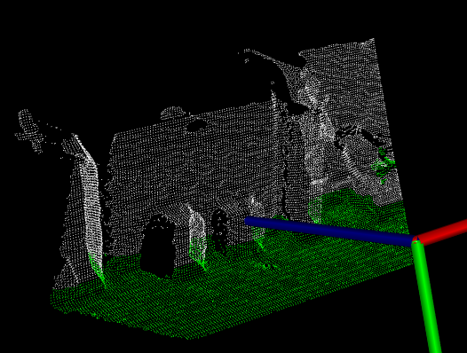
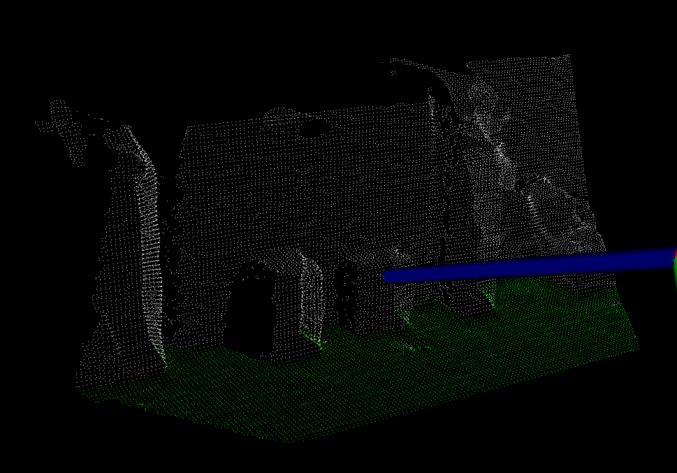
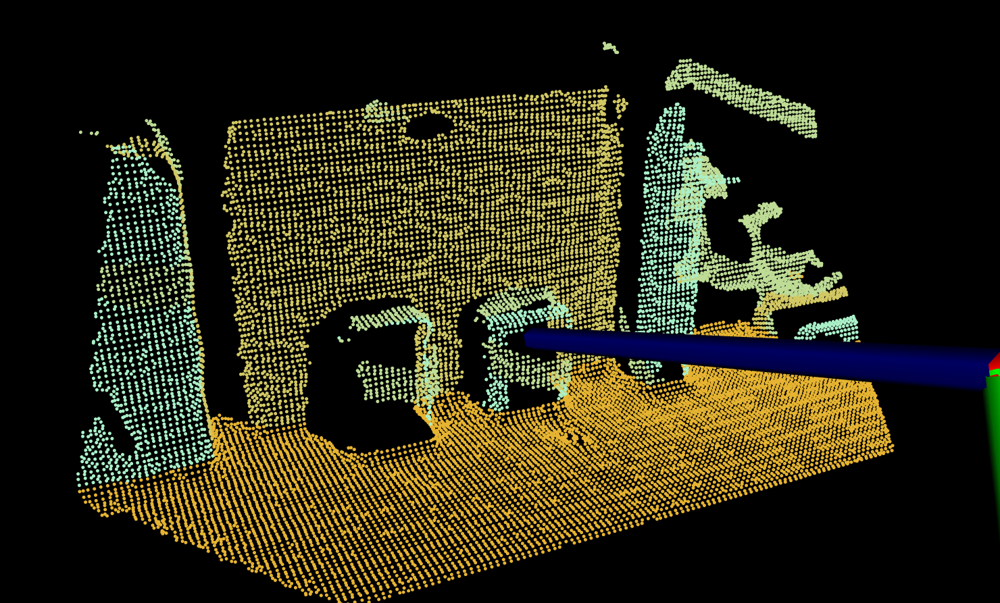

# Segmentation

## [single plane segmentation](./segmentation_plane.cpp)

从编程角度，segmentation API 就是将符合平面模型的点的index提取到`pcl::PointIndices`当中，然后`PointIndices`可以通过`pcl::ExtractIndices` 还原成点云，然后进行可视化。
这里的可视化是输入了两个点云。

点云的定义代码上可以简化一下，但是我看后面用完没销毁，可能因为是智能指针？（啥叫智能指针？）
【`boost::shared_ptr`是智能指针，当检测到没有程序引用之后会自动销毁，因此使用智能指针的时候不必考虑释放内存的问题。】

可以一次定义三个，虽然也没少写多少代码

```cpp
pcl::PointCloud<pcl::PointXYZ>::Ptr cloud (new pcl::PointCloud<pcl::PointXYZ>), filtered_cloud (new pcl::PointCloud<pcl::PointXYZ>), cloud_seg (new pcl::PointCloud<pcl::PointXYZ>);
```

分割部分，使用RANSAC方法确定inliers，`setDistanceThreshold`里是RANSAC的距离阈值。

|  |  |
| ------------------------------------------------------------ | ------------------------------------------------------------ |
|                                                              |                                                              |


```cpp
// segmentation
// coefficients就是平面方程的系数
    pcl::ModelCoefficients::Ptr coefficients (new pcl::ModelCoefficients);
// index是点云中点的索引值
    pcl::PointIndices::Ptr inliers (new pcl::PointIndices);
    // Create the segmentation object
    pcl::SACSegmentation<pcl::PointXYZ> seg;
    // Optional
    seg.setOptimizeCoefficients (true);
    // Mandatory
    seg.setModelType (pcl::SACMODEL_PLANE);
    seg.setMethodType (pcl::SAC_RANSAC);
    seg.setMaxIterations (1000);
    seg.setDistanceThreshold (0.05);
	seg.setInputCloud (filtered_cloud);
    seg.segment (*inliers, *coefficients);
```

`inliers`当中存储的是平面点的index，然后要根据这些index提取点，生成一个新的点云

```cpp
pcl::ExtractIndices<pcl::PointXYZ> extract;
    extract.setInputCloud(filtered_cloud);
    extract.setIndices(inliers);    // indices of those selected points
    extract.setNegative(false);
    extract.filter(*cloud_seg);
    std::cerr<<"Pointcloud representing the planar component: "<<cloud_seg->width * cloud_seg->height<<" data points.\n";
```

这里的可视化是通过两个点云叠加显示实现的

```cpp
pcl::visualization::PCLVisualizer::Ptr doubleCloudVisual (pcl::PointCloud<pcl::PointXYZ>::ConstPtr cloud1, pcl::PointCloud<pcl::PointXYZ>::ConstPtr cloud2)
{
  pcl::visualization::PCLVisualizer::Ptr viewer (new pcl::visualization::PCLVisualizer ("3D Viewer"));
  viewer->setBackgroundColor (0, 0, 0);
// base pointcloud
  viewer->addPointCloud<pcl::PointXYZ> (cloud1, "cloud1");
  viewer->setPointCloudRenderingProperties (pcl::visualization::PCL_VISUALIZER_POINT_SIZE, 1, "cloud1");
  viewer->setPointCloudRenderingProperties (pcl::visualization::PCL_VISUALIZER_COLOR, 255, 255, 255, "cloud1");
// plane pointcloud
  viewer->addPointCloud<pcl::PointXYZ> (cloud2, "cloud2");
  viewer->setPointCloudRenderingProperties (pcl::visualization::PCL_VISUALIZER_COLOR, 0, 255, 0, "cloud2");

  viewer->addCoordinateSystem (1.0);
  viewer->initCameraParameters ();
  return (viewer);
}
```

## [Multiple plane segmentation](./multi_plane_seg.cpp)



点云迭代分割出多个平面来

```cpp
    int i = 0;
    int nr_points = (int) filtered_cloud->size(); // c-style type conversion，这是一个C语言的类型转换
    std::vector<pointcloudPtr> cloud_clusters;	//这个vector收集子点云的指针
    while (filtered_cloud->size() > 0.3 * nr_points)	//当剩余点云不小于总点数的30%
    {
        seg.setInputCloud(filtered_cloud);
        seg.segment(*inliers, *coefficients);
        if (inliers->indices.size() == 0)
        {
            std::cout<<"Cannot estimate a planar model from the given dataset.\n";
            break;
        }
        pcl::ExtractIndices<pcl::PointXYZ> extract;
        extract.setInputCloud(filtered_cloud);
        extract.setIndices(inliers);
        extract.setNegative(false);
// get the points on the planar surface
        extract.filter(*cloud_plane);	// 这是拟合的平面上的点
        pointcloudPtr ptr (new pcl::PointCloud<pcl::PointXYZ> (*cloud_plane));	// 已有pointcloud 建立一个指针
        cloud_clusters.push_back(ptr);	//将这个指针压入vector中
        std::cout<<"pointcloud representign the planar component: "<<cloud_plane->size() <<" data points.\n";

//  filter
        extract.setNegative(true);
        extract.filter(*cloud_f);
// update the pointcloud, remove the fitted points
        *filtered_cloud = *cloud_f;
        i++;
    }
```

这里要将分割出来的每一个子点云存起来, 放入一个`pcl::PointCloud<pcl::PointXYZ>::Ptr`类型的`vector`当中. 必须要新建指针`pointcloudPtr ptr (new pcl::PointCloud<pcl::PointXYZ> (*cloud_plane));`, 不可以只是将`cloud_plane`放入vector中, 由于是智能指针, 最后vector中的所有元素全部指向最后一个指针.

```cpp
extract.filter(*cloud_plane);
pointcloudPtr ptr (new pcl::PointCloud<pcl::PointXYZ> (*cloud_plane));
cloud_clusters.push_back(ptr);
```

这里的可视化也是用的`vector`作为参数输入的，可以显示无限个点云

### multiple pointclouds visualization

```cpp
auto multiVisual(std::vector<pointcloudPtr> cloud_clusters)
{
    pcl::visualization::PCLVisualizer::Ptr viewer (new pcl::visualization::PCLVisualizer ("3D viewer"));
    viewer->setBackgroundColor (0, 0, 0);
    std::stringstream ss;
    int i = 1;
    for (auto cloud = cloud_clusters.begin(); cloud != cloud_clusters.end(); ++cloud)
    {
        ss<<"Pointcloud"<<i;
        std::cout<<ss.str()<<" has : "<<(*cloud)->size()<<"points.\n";
        viewer->addPointCloud<pcl::PointXYZ> ((*cloud), ss.str());
        viewer->addCoordinateSystem (1.0);
        float r = pclcolor(250 - 20*i), g = pclcolor(160+20*i), b = pclcolor(50*i);
        viewer->setPointCloudRenderingProperties(pcl::visualization::PCL_VISUALIZER_POINT_SIZE, 5, ss.str());
        viewer->setPointCloudRenderingProperties (pcl::visualization::PCL_VISUALIZER_COLOR, r,g,b, ss.str());
        viewer->initCameraParameters ();
        ++i;
        ss.str("");
    }
    return viewer;
}
```

`viewer->setPointCloudRenderingProperties (pcl::visualization::PCL_VISUALIZER_COLOR, r,g,b, ss.str());`

点的颜色要注意，`PCL_VISUALIZER_COLOR`，后面跟的颜色是从`0~1.0`的三个`float`，所以这里写了个函数做转换。

```cpp
float pclcolor(float color)
{
    return color / 255;
}
// 为了让不同点云的颜色区别开来，要注意rgb值的变化，如果rgb值总是差不多，那就一直是白色的了，看不出区别来了，所以这里r是递减的。
float r = pclcolor(250 - 20*i), g = pclcolor(160+20*i), b = pclcolor(50*i);
```

### stringstream

```cpp
for (auto cloud = cloud_clusters.begin(); cloud != cloud_clusters.end(); ++cloud)
    {
        ss<<"Pointcloud"<<i;
        std::cout<<ss.str()<<" has : "<<(*cloud)->size()<<"points.\n";
        viewer->addPointCloud<pcl::PointXYZ> ((*cloud), ss.str());
        viewer->addCoordinateSystem (1.0);
        float r = pclcolor(250 - 20*i), g = pclcolor(160+20*i), b = pclcolor(50*i);
        viewer->setPointCloudRenderingProperties(pcl::visualization::PCL_VISUALIZER_POINT_SIZE, 5, ss.str());
        viewer->setPointCloudRenderingProperties (pcl::visualization::PCL_VISUALIZER_COLOR, r,g,b, ss.str());
        viewer->initCameraParameters ();
        ++i;
        ss.str("");
    }
```

`std::stringstream`可以直接生成格式化字符串, 很好用. 用完可以用`.str("")`方法清空以便复用.

### iterator

vector的iterator是指向vector中元素的指针, 用的时候先用`*`取内容.

```cpp
for (auto cloud = cloud_clusters.begin(); cloud != cloud_clusters.end(); ++cloud)
```

